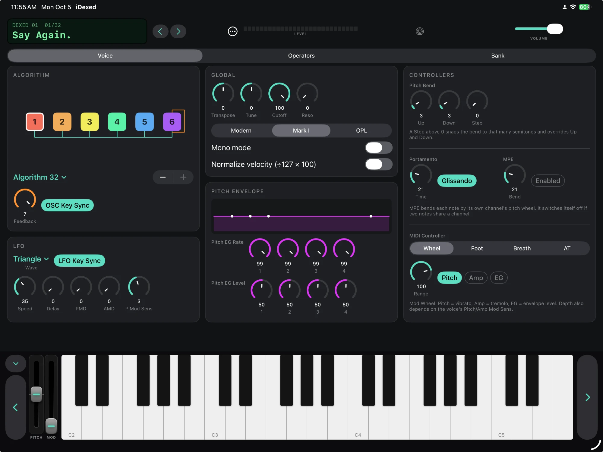
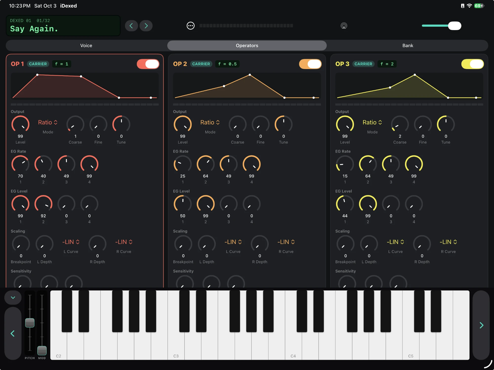
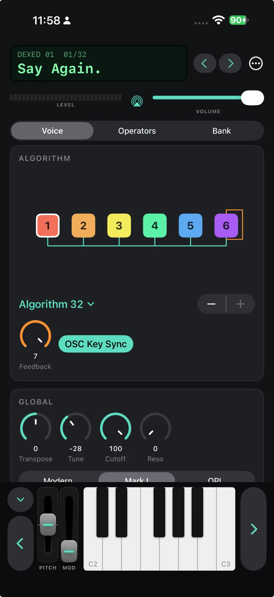

# iDexed

A native SwiftUI port of [Dexed](https://github.com/asb2m10/dexed), the open-source DX7 FM synthesizer, for macOS, iOS and iPadOS.

## Screenshots

| iPad: Voice | iPad: Operators |
| --- | --- |
|  |  |

  

## Project layout

- `DexedKit/` – Swift package: Dexed's msfa C++ engine (`CDexedEngine`, JUCE-free voice manager with a C API, output filter, Scala tuning) plus Swift patch/SysEx/audio/MIDI code and the AUv3 `DexedAudioUnit`.
- `iDexed/` – the app entry point and assets.
- `Shared/` – the SwiftUI editor, compiled into both the app and the plug-in.
- `iDexedAU/` – the AUv3 extension (instrument `aumu iDxd Kenr`), embedded in the app.
- Run engine/plug-in tests: `cd DexedKit && swift test`. Validate the plug-in: build the app, then `pluginkit -a <…/iDexedAU.appex>` and `auval -v aumu iDxd Kenr`.

## Features
6-operator editor with live operator/EG/output meters, algorithm diagram, 32-voice banks, SysEx import/export, factory banks,
on-screen keyboard with pitch/mod wheels, typing-keyboard and MIDI input, MIDI out (virtual source "iDexed") with
optional local-sound mute, output filter, master tune, Scala `.scl`/`.kbm` microtuning, AUv3 plug-in (macOS, iOS, iPadOS).

Also: MIDI CC mapping with MIDI learn, hardware DX7 SysEx send/receive (voice, bank and live edits), a cartridge manager
(browse the app's own Cartridges folder or any folder of banks, drag voices into the current bank, and send voices or banks to a DX7 from a right-click menu), MPE per-note pitch bend, and Mac shortcuts
(⌃1–6 show an operator, ⌃⇧1–6 toggle it, ⌃G / ⌃P / ⌃L switch sections).

MTS-ESP microtuning (macOS standalone app): with an MTS-ESP master such as ODDSound's MTS-ESP Mini running, iDexed follows its tuning,
including live retuning of held notes. It isn't available on iOS or iPadOS, which have no MTS-ESP masters, or inside the sandboxed AUv3 plug-in.
The client is ODDSound's open source `libMTSClient` (0BSD).

Everything in Dexed has now been ported, with those MTS-ESP limits.

## Getting more banks
iDexed reads standard DX7 SysEx (`.syx`) banks. The [Dexed project page](https://asb2m10.github.io/dexed/) links to a large
DX7 compilation by BlackWinny from KVR, `Dexed_cart_1.0.zip`. Unzip it, then in iDexed open the Bank tab ▸ **Folders ▸ Import Banks…**
and choose the unzipped folder. Its subfolders are kept and the banks appear in the searchable list under Cartridges.
You can also drop the files into the Cartridges folder yourself (**Folders ▸ Open Cartridges Folder**, or the Files app on iPad and iPhone)
and press **Rescan**.

## License
GPL v3 (derived from Dexed). msfa engine files are Apache-2.0 (Google / Pascal Gauthier). See `LICENSE`.
